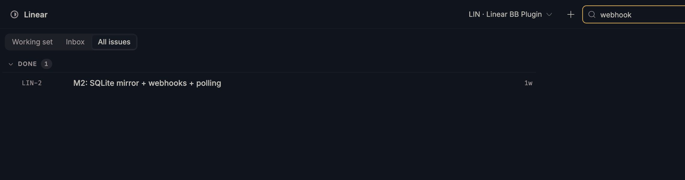
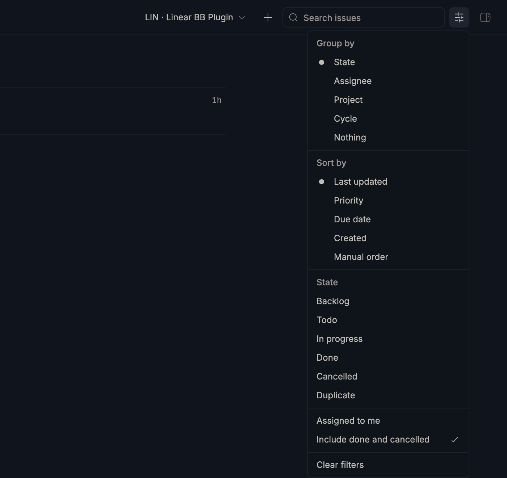
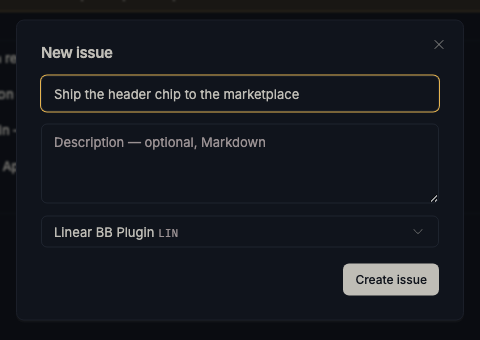

<p align="center">
  
</p>

<h1 align="center">Linear for bb</h1>

<p align="center">
  Linear inside <a href="https://getbb.app">bb</a> — issues, inbox, projects and cycles at
  parity for daily engineering work — and every bb thread <em>knowing which issue it is
  working on</em>, live, in the header, the side panel, and the agent's own context.
</p>

<p align="center">
  
</p>

---

## The browser

The screenshot above is the left nav panel: a list-first Linear browser at
sidebar width, rendered from a **local SQLite mirror**, so every read is
instant, offline-tolerant, and free. Your team's board becomes collapsible
state groups — finished work starts folded behind a count, open work gets the
screen. Priorities mark only what deserves a mark: `!!` urgent, `!` high,
nothing for the rest.

## Search

Full-text, over the mirror, answering as you type. A miss says how many
issues the cleared view holds, and the button under it clears the filters —
the sentence and the control agree.

<p align="center">
  
</p>

## Group, sort, filter

Group by state, assignee, project or cycle. Sort by activity, priority, due
date, age, or Linear's own manual order. The filter facets are **derived from
your team's actual workflow** — a triage-enabled team gets a Triage chip, a
team without one never sees it.

<p align="center">
  
</p>

## Capture

The `+` in the header files an issue with the two fields you have at the
moment of capture — a title, and maybe a description. It lands directly in
the new issue's detail pane, where everything else has a real editor. A
create form with nine fields loses the race against a sticky note.

<p align="center">
  
</p>

## The thread chip

Every bb thread resolves *which issue it is working on* through a
deterministic ladder — an explicit link, the branch name Linear generated, an
issue key in the conversation, and only then a fuzzy title match that
**suggests instead of binding**. A thread whose title merely resembles an
issue gets a question, not a bind:


One click accepts it, and the chip becomes the issue — state glyph and all.
The binding is injected into every agent turn's instructions, so agents in
**any provider** know their task with zero tool calls:


## The issue pane

The bound issue — or any issue you open — in full: description, properties
with in-place editors (state, assignee, priority, estimate, labels, project,
cycle, due date), sub-issue progress, comments with Markdown. The `···` menu
starts a thread from the issue, copies its identifier or branch name, or
archives it behind a confirmation.

<p align="center">
  
</p>

## The inbox

Your Linear inbox as a segment with a badge: assignments, replies, mentions
and blockers, dismissible row by row. A toast fires only when something *new*
arrives — never for what was already waiting when you looked.

<p align="center">
  
</p>

## The consent switch

Turn off "Allow changes to Linear" and every mutation — edits, comments,
creations, webhook registration — is refused with a sentence naming the
switch, while every read keeps working. Enforced at the one transport door
every mutation leaves through, so a surface added later is gated the day it
is written.

<p align="center">
  
</p>

## Agents get the real thing

Thirteen `linear_*` tools over one credential, identical in Claude, Codex,
Kimi, OpenCode and Gemini threads: the team's own vocabulary (states, labels,
people, estimate scale — never guessed), search that answers locally and
escalates to Linear on request, consolidated reads and writes, and the two
tools no remote integration can have — this thread's **own binding**,
readable and writable. A bundled skill teaches the conventions.

## Everything else

- **Keyboard-first** — `j`/`k` move, `Enter` opens, `/` finds, `g i` and
  `g a` switch segments; folded groups are skipped, never walked through.
- **Working set** — the default segment: issues your threads are working on
  right now, and what's assigned to you but never started.
- **Start a thread from any issue** — row menu, detail `···`, or
  `bb linear start ENG-42`: the thread spawns with the issue's description
  and recent comments as context, on the right project, with Linear's own
  branch name — bound from its first paint.
- **Issues in chat** — `::linear{key="ENG-42"}` renders as a live issue chip
  in any message; "Open in Linear" on a message resolves every identifier it
  names.
- **Up to four workspaces** — each discovered from its own API key; nothing
  configured by hand, and cross-workspace ambiguity is refused by name
  rather than resolved by luck.
- **Write-back automations, off by default** — a bound thread starting can
  lift the issue into the team's started state; a merged PR can move it per
  the team's own Linear git automation. Off, because two writers fighting
  over one card is worse than either alone.
- **Webhooks as an upgrade, not a dependency** — registered only after a
  signed self-test proves the URL reaches this bb; delivery is health-checked
  and demotion back to polling is a log line, not an outage.
- **Budgeted** — Linear's rate-limit headers are read on every response;
  background polling slows itself under pressure and a person's click goes
  to the front of the queue.
- **Verified offline** — every GraphQL document ships as inspectable text,
  validated against the vendored SDL by the test suite; complexity is
  estimated per document and capped below Linear's ceiling.
- **Secrets stay secrets** — keys live in bb's secret store and every error,
  log line, tool result and rpc payload is redacted at construction.
- **Nothing hardcoded** — no team, state name, label scheme or estimate
  scale appears in this code; everything is discovered from the workspace at
  runtime, in the workspace's own language.

## Install

```sh
bb plugin install git:https://github.com/vburojevic/bb-plugin-linear.git@main
```

Installing needs `git` and `npm` on your PATH: bb clones the repository,
installs the runtime dependencies, and builds the frontend on your machine.
Nothing pre-built ships in the repo — what runs is what you can read.

Create a personal API key in Linear under **Settings → Account → Security &
access → Personal API keys** (read is enough to browse; write to change
anything), then:

```sh
bb plugin config linear set apiKey <key>
bb linear teams
bb linear bind ENG
```

## The CLI

```
bb linear status | doctor | budget        connection, diagnosis, rate budget
bb linear teams | bind | unbind | refresh teams and project bindings
bb linear issues | issue | create | sync  the mirror, read and written
bb linear move | assign | set | comment   one issue, changed
bb linear attach | archive                links; reversible archive
bb linear inbox | webhook | forget        inbox; webhooks; leave no trace
bb linear start | link | unlink           threads from issues, issues on threads
```

Every read answers from the local copy. Run any read with `--json` for
machine output.

## Philosophy

What bb already owns — threads, environments, worktrees, branch names, git
state, PR status, the markdown renderer, the composer, the toaster, the
settings form, the credential store — this plugin reads and never rebuilds.

It talks to Linear over the GraphQL API with its own credential rather than
through Linear's MCP server, because a background service cannot borrow an
agent CLI's OAuth session — it could not poll, notify, or move an issue when
a pull request merges at 2am — and an MCP-only integration is invisible to
every other provider bb runs. Where your agents *do* have Linear MCP, the
write-back automations stay off by default so the two never fight.

MIT. Built in the open; the [BRIEF](./BRIEF.md) records every decision with
the alternative it beat.
