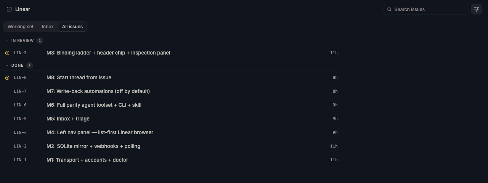
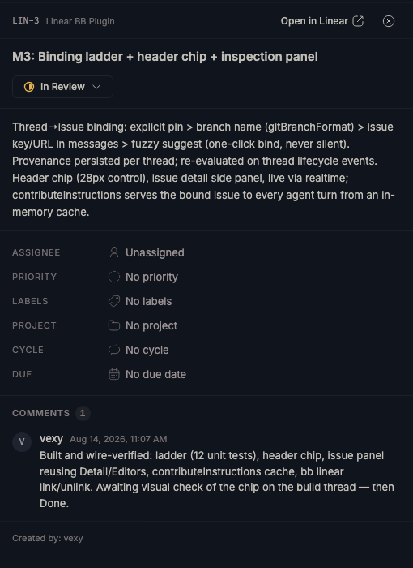
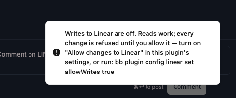

# Linear for bb

Linear inside bb — issues, inbox, projects and cycles at parity for daily
engineering work — and every bb thread knowing which issue it is working on,
live, in the header, the side panel, and the agent's own context.



---

## What it does

**A client.** The left nav panel is a list-first Linear browser at sidebar
width: your teams' boards as collapsible state groups, filters and facets,
full-text search, projects, cycles, and your Linear inbox with a badge — all
rendered from a local mirror, so every read is instant and free.

**A seam.** Every thread resolves *which issue it is working on* through a
deterministic ladder — an explicit link, the branch name Linear generated, an
issue key in the conversation, and only then a fuzzy title match that
**suggests instead of binding**. The bound issue appears in the thread header,
opens in full in the side panel (description, properties, comments, state
picker), and is injected into every agent turn's instructions — so agents in
any provider know their task with zero tool calls.

A thread whose title merely *resembles* an issue gets a question, not a bind:


One click accepts it, and the chip becomes the issue — state glyph and all:


The side panel is the issue in full — description, properties, comments, and
every property editable in place:




**Agents get the real thing.** Thirteen `linear_*` tools over one credential,
identical in Claude, Codex, Kimi, OpenCode and Gemini threads: the team's own
vocabulary (states, labels, people, estimate scale — never guessed), search
that answers locally and escalates to Linear on request, consolidated reads
and writes, and the two tools no remote integration can have — this thread's
own binding, readable and writable. A bundled skill teaches the conventions.

**Write-back that keeps its hands visible.** Optional automations move the
issue as work moves — a bound thread starting lifts it into the team's started
state; a pull request moves it per the team's **own** Linear git-automation
configuration. Both ship **off**: many teams' agents already drive Linear
themselves, and two writers fighting over one card is worse than either alone.

**And the reverse seam.** `bb linear start ENG-42` (or the panel's start
action) spawns a thread with the issue's description, acceptance criteria and
recent comments as context, on the right project, with the issue's own branch
name — linked from its first paint.

## Install

```sh
bb plugin install git:https://github.com/vburojevic/bb-plugin-linear.git@main
```

Installing needs `git` and `npm` on your PATH: bb clones the repository,
installs the runtime dependencies, and builds the frontend on your machine.
Nothing pre-built ships in the repo — what runs is what you can read.
Checking for updates needs neither.

Create a personal API key in Linear under **Settings → Account → Security &
access → Personal API keys** (read is enough to browse; write to change
anything), then:

```sh
bb plugin config linear set apiKey <key>
```

A second Linear workspace needs a second key — a personal key is scoped to one
workspace — so the settings carry four slots (`apiKey2`…). Each workspace is
discovered from its key; nothing about a workspace is ever configured by hand.

Bind a bb project to a team and the mirror fills itself:

```sh
bb linear teams
bb linear bind ENG
```

## The CLI

```
bb linear status | doctor | budget        connection, diagnosis, rate budget
bb linear teams | bind | unbind | refresh teams and project bindings
bb linear issues | issue | create | sync  the mirror, read and written
bb linear move | assign | set | comment   one issue, changed
bb linear attach | archive                links; reversible archive
bb linear inbox | webhook | forget        inbox; webhooks; leave no trace
bb linear start | link | unlink           threads from issues, issues on threads
```

Every read answers from the local copy. Run any read with `--json` for
machine output.

## How it holds up

- **Verified offline.** Every GraphQL document ships as inspectable text and
  is validated against the checked-in SDL by the test suite — a wrong field
  name fails in milliseconds on a laptop, not at runtime in someone's
  workspace. Complexity
  is estimated per document and capped below Linear's ceiling.
- **Budgeted.** Linear's rate-limit headers are read on every response,
  including failures; background polling slows itself under pressure and a
  person's click goes to the front of the queue right up until it would
  actually fail.
- **Webhooks are a latency improvement, not a dependency.** Registration
  happens only after a signed self-test proves the URL reaches this bb;
  delivery health is watched, and demotion back to polling is a log line, not
  an outage.
- **One switch makes it read-only.** Turn off "Allow changes to Linear" and
  every mutation — issue edits, comments, creations, webhook registration —
  is refused with a sentence naming the switch, while every read keeps
  working. Enforced at the one transport door every mutation leaves through,
  so a surface added later is gated the day it is written; a check that
  breaks refuses rather than allows.

  
- **Secrets stay secrets.** Keys live in bb's secret store, are read fresh on
  every request, and every error, log line, tool result and rpc payload is
  redacted at construction.
- **Nothing hardcoded.** No team, state name, label scheme, priority string
  or estimate scale appears in this code — everything is discovered from the
  workspace at runtime, in the workspace's own language.

## Philosophy

What bb already owns — threads, environments, worktrees, branch names, git
state, PR status, the markdown renderer, the composer, the toaster, the
settings form, the credential store — this plugin reads and never rebuilds.

It talks to Linear over the GraphQL API with its own credential rather than
through Linear's MCP server, because a background service cannot borrow an
agent CLI's OAuth session — it could not poll, notify, or move an issue when
a pull request merges at 2am — and an MCP-only integration is invisible to
every other provider bb runs. Where your agents *do* have Linear MCP, the
write-back automations stay off by default so the two never fight.

MIT. Built in the open; the [BRIEF](./BRIEF.md) records every decision with
the alternative it beat.
